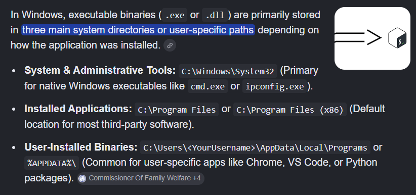

# Conti :

An Exchange server was compromised with ransomware. Use Splunk to investigate how the attackers compromised the server. 

**Warning**: Do **NOT** attempt to visit and/or interact with any URLs displayed in the ransom note. 

 Read the latest on the Conti ransomware “[https://www.bleepingcomputer.com/news/security/fbi-cisa-and-nsa-warn-of-escalating-conti-ransomware-attacks/](https://www.bleepingcomputer.com/news/security/fbi-cisa-and-nsa-warn-of-escalating-conti-ransomware-attacks/)”

Can you identify the location of the ransomware? : 

for this we have given a hint : Look for a common Windows binary located in an unusual location. 



now we know the common locations of the windows binaries so we will look for the locations other that this to perform initial analysis . 

we have to start the search with this query : 

```html
index="*"
```

and set the time to all time  

we have different sourcetypes so i am going to use the windows sysmon logs for this analysis : 

```html
index="*" sourcetype="WinEventLog:Microsoft-Windows-Sysmon/Operational"
```

now in the interesting field  , we got an field named current_directory in this i found these directories : 


from this all directories are the common directories for the binaries or other program files but the suspicious one is the last one ; [c:\Users\Administrator\Documents\](http://10.48.135.11:8000/en-GB/app/search/search?q=search%20index%3D%22*%22%20sourcetype%3D%22WinEventLog%3AMicrosoft-Windows-Sysmon%2FOperational%22&display.page.search.mode=smart&dispatch.sample_ratio=1&workload_pool=&earliest=0&latest=&sid=1782307781.52#) 

so now i will apply this directory as filter : 

```html
index="*" sourcetype="WinEventLog:Microsoft-Windows-Sysmon/Operational" CurrentDirectory="c:\\Users\\Administrator\\Documents\\"
```

now only one event is returned : 

and now in this under the image field we got this : 


and this is the answer to the first question because cmd.exe is suspicious in the users directory . 

ANSWER :[C:\Users\Administrator\Documents\cmd.exe](http://10.48.135.11:8000/en-GB/app/search/search?q=search%20index%3D%22*%22%20sourcetype%3D%22WinEventLog%3AMicrosoft-Windows-Sysmon%2FOperational%22%20CurrentDirectory%3D%22c%3A%5C%5CUsers%5C%5CAdministrator%5C%5CDocuments%5C%5C%22&display.page.search.mode=smart&dispatch.sample_ratio=1&workload_pool=&earliest=0&latest=&sid=1782307933.53#)

What is the Sysmon event ID for the related file creation event? 

now i am using this query for further investigation : 

```html
index="*" sourcetype="WinEventLog:Microsoft-Windows-Sysmon/Operational" Image="C:\\Users\\Administrator\\Documents\\cmd.exe"
```

under the event code field we ae getting most of the events from the eventcode 11 so this may be the answer but we have to first confirm this : 

The answer to this would be event code 11. this represents the file creation . 

Can you find the MD5 hash of the ransomware? 

for this we would use this query : 

```html
index="*" sourcetype="WinEventLog:Microsoft-Windows-Sysmon/Operational" Image="C:\\Users\\Administrator\\Documents\\cmd.exe" MD5
```

and the answer is this  : 

290C7DFB01E50CEA9E19DA81A781AF2C

What file was saved to multiple folder locations? 

```html
index=* sourcetype="WinEventLog:Microsoft-Windows-Sysmon/Operational" EventCode=11
```

for this i used the above query : 

then i got an interesting field named targetfilename 

to filter the output in the readable format i used stats command : 

```html
index=* sourcetype="WinEventLog:Microsoft-Windows-Sysmon/Operational" EventCode=11 | stats count by TargetFileName
```

and in this  i got multiple events with the readme.txt so this is the file . and the answer is readme.txt 

What was the command the attacker used to add a new user to the compromised system?

as we know that  net command is used to add users in windows so we can search for add using this : 

```html
index=* sourcetype="WinEventLog:Microsoft-Windows-Sysmon/Operational" add 
```

total 9 events were returned now in the commandline field i saw different commandlines to view then properly  i used this : 

```html
index=* sourcetype="WinEventLog:Microsoft-Windows-Sysmon/Operational" add 
|  stats count by CommandLine
```

now i saw these command used : 


the answer is :  net  user /add securityninja hardToHack123$

The attacker migrated the process for better persistence. What is the migrated process image (executable), and what is the original process image (executable) when the attacker got on the system?

we are given with this hint : Try Sysmon event code 8. 

Sysmon Event ID 8 (`CreateRemoteThread`) **detects when a process creates a thread within another process**

so i used this : 

```html
index=* sourcetype="WinEventLog:Microsoft-Windows-Sysmon/Operational" EventCode=8
```

2 events returned and there are two interesting fields that are useful for us so i created a table for better visualization : 

```html
index=* sourcetype="WinEventLog:Microsoft-Windows-Sysmon/Operational" EventCode=8 
|  table SourceImage TargetImage UtcTime
```

i also used the time field to get the first one that is : 


the answer is : **C:\Windows\System32\WindowsPowerShell\v1.0\powershell.exe,C:\Windows\System32\wbem\unsecapp.exe** 

The attacker also retrieved the system hashes. What is the process image used for getting the system hashes? 

from the previous answer’s image we can see that the process **unsecapp.exe  is migrating to the lsass which handles the authentication and authorization in the windows s o this is the answer .** 

so the answer is :C:\Windows\System32\lsass.exe

What is the web shell the exploit deployed to the system? 

for this we have to change our source type as given in the hint we can look for the iis sourcetype logs : 

```html
index=* sourcetype="iis"
```

then i used a field cs_method which stands for client to server method in iis logs : 


then i used cs_method field as filter with the post methods : 

```html
index=* sourcetype="iis" cs_method=POST
```

we are searching for the post method because the web shell is uploaded and this type of actions are performed using the post method .

now i got an interesting field in the events returned from the above query and that was : 

cs_uri_stem : 


so i used this as fliter : using the table command 

```html
index=* sourcetype="iis" cs_method=POST 
| table cs_uri_stem
```

in this result we can se a suspicious named .aspx file this is the answer to our question : 

answer : i3gfPctK1c2x.aspx 

What is the command line that executed this web shell? 

for this  i just used this simple query : 

```html
index=* sourcetype="wineventlog:microsoft-windows-sysmon/operational" i3gfPctK1c2x.aspx
```

and this returned only 1 event and in the commandline field we can see the commandlin command used with this filename in it 

answer : attrib.exe -r \\\\win-aoqkg2as2q7.bellybear.local\C$\Program Files\Microsoft\Exchange Server\V15\FrontEnd\HttpProxy\owa\auth\i3gfPctK1c2x.aspx

What three CVEs did this exploit leverage? Provide the answer in ascending order.

this requires some research related to the conti virus i found the best one one this :

for this we have to analyze the vulnerabilities that this ransomware exploited in this particular challenge .

i found these cves here : [https://www.sentinelone.com/anthology/conti/](https://www.sentinelone.com/anthology/conti/)

answer ; 

**CVE-2021-31207**, CVE-2021-34473, and CVE-2021-34523.