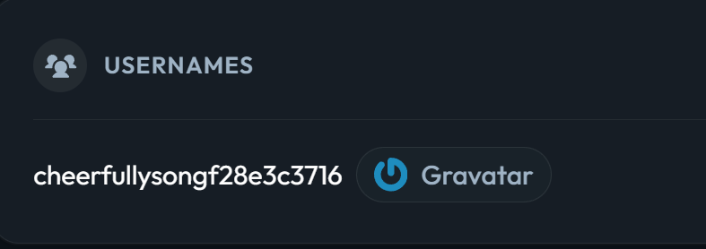

# Overheard at Breakfast

Two strangers. One conversation. One profile they never meant to reveal.

hints : 

The breakfast terrace is loud this morning, clinking cutlery, espresso machines, the usual chatter. One guest couldn't help but linger at a nearby table, seeing more of a conversation than they were meant to.

When the table's occupant stepped away for a refill, they seized the moment and grabbed a screenshot before it could disappear. Somewhere in that conversation is enough to track down an account nobody was supposed to find.

we have given a screenshot of the conversation : 


in this conversation the user ponzi is asking for the social media account of lambo so that ponzi/ influencer can tag him in his posts , 

in reponse to this , lambo is saying that he use a free tool that let him to upload his profile and link other media accounts neat until he wiped everything and the name of that tool starts with G and he is also giving his gmail for future communication : 

```bash
lambobytelotushotel@gmail.com
```

i used behind the mail free website to find the accounts related to this mail and i got an account on : Gravatar 



also got the link to the account : 


gravatar link redirected me to the lambo’s account and in his bio i got this md5 ( given in the hint ) string : 


the string i got : 


```bash
VEhNe1MzY3JlVF9QcjBmaWwzX0g0c19iMzNuX0lkZW50MWZpM2R9
```

then i used dencode website to decode this string and got the final flag : 

```bash
	
THM{S3creT_Pr0fil3_H4s_b33n_Ident1fi3d}

```