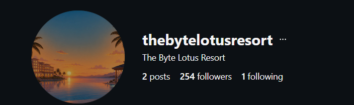

# The Brochure :

The brochure's hero photo has an AI fingerprint. Follow the account that posted it, and the trail doesn't end at the hotel; it ends at someone the hotel never mentioned.

this is  an osint challenge this first thing i noticed on the brochure image is the name of the resort and from the another text on the brochure is “some things aren’t posted some clues are find us on instagram or not “ 

so i searched the instagram for the byte lotus resort account . 



then in this account’s post i checked all the comment and other clues but i got nothing , then i tried out the first post on this account and on that post’s comments i got an comment with the user name : 


i checked this user account :


it is looking for our interest becausse the bio of this account has written → tryhackme room 

then i saw the 2 followings of this acccount and i got this : 


one is the byte lotus resort and the other is vera , on the second account i got three posts with some strings written on the image i joined the three strings and this was looking like a base 64 encoded string so i decoded this and got this : 

VEhNe1YzckBzX2FDQzB1bnRfaDRzX2IzM25fZjB1bmQhfQ==

decoded : 

```bash
THM{V3r@s_aCC0unt_h4s_b33n_f0und!}
```