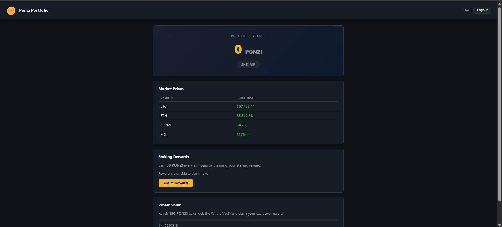

# Towel on the Sunbed

> **Challenge Quote:**
> 
> 
> *"Ponzi set his towel down for one 24-hour reward claim. He came back to find the sunbed had been 'claimed' three times over while he wasn't looking."*
> 

## Challenge Itinerary

1. Create a guest account and explore Ponzi's daily reward mechanism.
2. Identify the business logic flaw standing between a regular user and **Whale Vault** status.
3. Bypass the rate limit restriction to retrieve the flag from the vault.

## Initial Reconnaissance & Application Flow

1. Navigated to the target lab IP address hosting the **Ponzi Portfolio** login interface.
2. Registered a new test account (`test1`) to inspect the dashboard functionality.

### Observed Application Logic

- **Initial Balance:** `0 PONZI` (Shrimp Tier).
- **Reward Mechanism:** Allows users to claim **50 PONZI** once every 24 hours via a `POST /claim` endpoint.
- **Objective:** Reach **150 PONZI** to unlock the **Whale Vault** and claim the flag.

## Exploitation: Race Condition (Limit Overrun)

Because the application checks whether a reward has been claimed before updating the balance, an asynchronous race condition allows multiple simultaneous requests to be processed within the same execution window before the database sets the cooldown timestamp.

### Step 1: Intercept & Group Requests

1. Triggered the **Claim Reward** action while intercepting HTTP traffic in **Burp Suite**.
2. Sent the captured `POST /claim` request to **Repeater**.
3. Right-clicked the request tab in Repeater, selected **Add tab to group**, and created a new tab group named `flag`.

### Step 2: Duplicate Requests

1. Right-clicked the request tab within the new group and selected **Duplicate tab**.

Generated multiple duplicate tabs (~25 requests) within the same group. Since each valid request grants **50 PONZI**, sending 3–5 successful requests simultaneously bypasses the 150 PONZI threshold (`50 × 4 = 200 PONZI`).

### Step 3: Execute Single-Packet / Parallel Attack

1. Clicked the send dropdown menu in Repeater.
2. Selected **Send group in parallel** to execute all grouped requests concurrently.

## Result & Flag Retrieval

1. Upon sending the parallel request group, multiple requests succeeded before the 24-hour lock was enforced by the backend database.
2. Refreshed the dashboard page to confirm the balance updated to over **150 PONZI**.
3. The **Whale Vault** unlocked successfully.
4. Clicked **Open Vault** to retrieve the challenge flag.