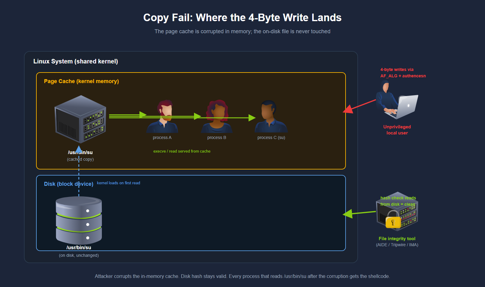

# CVE-2026-31431: Copy-Fail

CVE-2026-31431, nicknamed Copy Fail, includes a  732-byte Python script with no external packages, run by any unprivileged local user, returns a root shell in seconds.

The researcher's own description of the primitive frames it concisely: *"an unprivileged local user can write four controlled bytes into the page cache of any readable file on a Linux system, and use that to gain root."*

base score of 7.8 (High)

It was reported by Taeyang Lee, a researcher at Theori

full disclosure is published at “[https://xint.io/blog/copy-fail-linux-distributions](https://xint.io/blog/copy-fail-linux-distributions)”

The vulnerability sat silently in virtually every mainstream Linux distribution for nine years, from a 2017 kernel optimisation through to the April 2026 patch.

### Understanding The Vulnerability :

**The Linux Page Cache**

The **page cache** is a region of kernel memory that holds copies of recently-read file contents to avoid repeated disk reads.

The cache is shared by everyone using the same system. This means all programs and containers on that computer use the same stored memory copy (cache) of a file.

Normally, when a file is changed, two things are updated:

1. The actual file saved on the disk.
2. The cached version stored in memory.

But sometimes, the cached version in memory can be changed directly without changing the real file on the disk. So the system may temporarily show modified data even though the original file remains unchanged.

This is important because security tools like AIDE, Tripwire, and IMA check files by reading the actual file stored on the disk and creating a hash from it.

If only the memory cache (page cache) is changed and the real file on the disk is not modified:

- The security tools still see the original clean file on disk.
- The hash value matches correctly.
- So the integrity check says the file is safe.

However, when the system runs that file, the kernel may load the modified version stored in memory instead of the clean disk version.

So:

- Disk file = clean
- Memory-cached version = corrupted or malicious
- Integrity tools = fooled because they only check the disk copy, not the memory copy.



image : tryhackme.com

### 1. What is AF_ALG?

AF_ALG is a special Linux feature that lets normal programs use the Linux kernel’s built-in cryptography system through sockets.

Programs can use it for:

- Encryption/decryption
- Hashing
- Authentication checks

The important part is:

- Even normal users can access it.
- No admin/root permission is needed.

Some trusted programs use it normally, such as:

- cryptsetup
- systemd-cryptsetup
- strongSwan

---

## 2. The Vulnerable Part: `authencesn`

`authencesn` is a kernel cryptography component used for IPsec encryption.

During decryption, it temporarily writes 4 bytes into an output buffer as part of its internal processing.

The dangerous mistake is:

1. It writes the 4 bytes first.
2. Then it checks whether the authentication (HMAC) is valid.

If the authentication fails:

- The kernel returns an error.
- But the 4-byte write already happened.
- The kernel does not undo the write.

So even a “failed” crypto operation can still modify memory.

---

## 3. Why `splice()` Matters

`splice()` is a Linux system call designed for very fast data transfer.

Normally:

- Data is copied from one place to another.

But `splice()` avoids copying:

- It simply shares references to the same memory pages.

Example:

If `/usr/bin/su` is spliced into a socket:

- The socket directly references the actual cached memory pages of `/usr/bin/su`.
- Not a copy.

This is called **zero-copy behavior**.

---

## 4. The 2017 Optimization That Created the Bug

In 2017, Linux developers optimized the AF_ALG system.

Before:

- Input memory and output memory were separate.

After optimization:

- The kernel reused the same memory for both input and output:

```
req->src=req->dst;
```

Normally this was safe for regular user data.

But with `splice()`:

- The “output” memory was actually the kernel’s own file page cache.

So now:

- The crypto code’s 4-byte temporary write could directly modify cached file pages belonging to real system files.

---

## 5. The Exploit

By combining:

- AF_ALG
- `authencesn`
- `splice()`
- The 2017 optimization

an attacker gets:

### A controlled 4-byte write into the page cache of any readable file.

The attacker controls:

- **What** bytes are written
- **Where** they are written

The actual disk file stays unchanged.

But the cached in-memory version becomes modified.

---

## 6. Why This Is Dangerous

Linux often executes programs directly from cached memory pages.

So:

- Disk file = original clean version
- Memory cache = modified malicious version

Security tools check the disk file and see nothing wrong.

But when the file runs:

- The kernel may execute the malicious cached version instead.

---

## 7. How the Full Attack Works

The attacker:

1. Opens the target file (example: `/usr/bin/su`)
2. Uses `splice()` to attach its page cache pages to AF_ALG
3. Triggers the vulnerable crypto operation
4. Writes 4 malicious bytes into memory
5. Repeats this many times

Around 40 repetitions are enough to place working shellcode into the cached executable.

Result:

- The next execution of the file runs attacker-controlled code.

# Flow of the Exploit

The attack targets:

```
/usr/bin/su
```

`su` is a **setuid-root** program, meaning:

- It always runs with root privileges.
- Even if started by a normal user.

The exploit changes only the **cached in-memory version** of `su`, not the real file stored on disk.

So when `su` executes:

- The kernel loads the malicious cached version.
- The attacker gains a root shell.

---

# Step-by-Step Simplified Explanation

## Step 1 — Start as a Normal User

The attacker begins as a completely unprivileged user:

```
uid=1001(karen)
```

No sudo.

No admin rights.

No special permissions.

---

# Step 2 — What the Python Script Does

The script:

```
exploit.py
```

uses only normal Python libraries:

- `os`
- `socket`
- `zlib`

No external hacking tools are needed.

---

# Step 3 — How the Exploit Works Internally

The script repeatedly performs these actions:

---

## A. Open AF_ALG Crypto Socket

It opens a special Linux crypto socket:

```
socket(AF_ALG)
```

This gives access to the vulnerable crypto subsystem.

---

## B. Use `splice()` on `/usr/bin/su`

The script uses:

```
splice()
```

to attach the page cache of `/usr/bin/su` directly into the crypto pipeline.

Important:

- This references the real cached memory pages of the file.
- Not a copy.

---

## C. Trigger the Vulnerable Write

The script calls:

```
recvmsg()
```

This triggers the vulnerable `authencesn` code.

That code:

- writes 4 attacker-controlled bytes
- into the page cache of `/usr/bin/su`

even though the authentication check later fails.

---

## D. Repeat About 40 Times

Each call writes only 4 bytes.

So the exploit repeats the process many times:

- writing chunk after chunk of shellcode
- directly into memory

Eventually enough malicious code exists inside the cached executable.

---

# Step 4 — Execute `/usr/bin/su`

Finally the script runs:

```
execve("/usr/bin/su")
```

The kernel now loads:

- the modified cached version
instead of
- the clean disk version.

Because `su` is setuid-root:

- the shellcode runs as root.

Result:

```
uid=0(root)
```

---

# Step 5 — Why Hash Checks Still Show “Clean”

After exploitation:

```
sha256sum /usr/bin/su
```

still shows the original correct hash.

Why?

Because:

- the disk file was never changed
- only RAM/page cache was modified

Security tools like:

- AIDE
- Tripwire
- IMA

check the disk file only.

So they report:

that the file is clean 

even though the kernel executed malicious code from memory.

---

# Step 6 — Cleanup Removes Evidence

After getting root, the exploit cleans itself up using:

```
posix_fadvise(POSIX_FADV_DONTNEED)
```

This tells Linux:

> “These cached pages are no longer needed.”
> 

The kernel then removes the modified pages from memory.

Next time `/usr/bin/su` is opened:

- Linux reloads the original clean file from disk.

execute the [exploit.py](http://exploit.py) using the command :  “python3 exploit.py” 

on hitting enter we got the root shell 

we can check the root privileges using the command “ id” 

and then go to the /root and read the flag.txt using cat .

### Detection and Mitigation :

# Why `SOCK_SEQPACKET` Matters

There are different AF_ALG socket types.

Normal crypto programs often use:

- `SOCK_DGRAM`

But this exploit specifically needs:

- `SOCK_SEQPACKET`

That makes detection easier because:

- `SOCK_SEQPACKET` AF_ALG usage is uncommon on most systems.

---

# 2. Which Programs Normally Use AF_ALG?

Only a small set of legitimate programs usually use these sockets, including:

- cryptsetup
- systemd-cryptsetup
- strongSwan
- `kcapi-*` tools
- `bluez`
- `iwd`

So if a random process suddenly creates many AF_ALG sockets:

- it becomes highly suspicious.

---

# 3. Important Syscalls to Monitor

| Syscall | Why It Matters |
| --- | --- |
| `socket(AF_ALG)` | Opens vulnerable crypto socket |
| `splice()` | Connects file page cache to crypto pipeline |
| `recvmsg()` | Triggers the 4-byte memory corruption |
| `execve()` | Executes modified setuid binary |
| `posix_fadvise(DONTNEED)` | Cleans evidence from page cache |

---

# 4. Detection Logic

A strong detection chain looks like this:

```
socket(AF_ALG)
      ↓
splice()
      ↓
many recvmsg() calls
      ↓
execve(/usr/bin/su)
      ↓
posix_fa**dv**ise(DONTNEED)
```

This sequence is extremely unusual for legitimate software.

---

# 5. Why Timing Matters

The exploit cleans itself up very fast.

After cleanup:

- Disk = clean
- Page cache = clean
- No modified binary exists anymore

So defenders must detect:

- the exploit activity live
instead of
- investigating later.

This is called **behavior-based detection**.

---

# 6. MITRE ATT&CK Mapping

Security teams map the exploit to known attack techniques:

| Technique | MITRE ID |
| --- | --- |
| Kernel privilege escalation | T1068 |
| Container escape | T1611 |
| Setuid abuse | T1548.001 |
| Evidence cleanup | T1070 |

---

# 7. How to Mitigate the Vulnerability

The vulnerable component is:

```
algif_aead
```

This kernel module provides the vulnerable AF_ALG AEAD functionality.

---

# Temporary Fix (Ubuntu/Debian)

Disable the module:

```
echo"install algif_aead /bin/false" |sudotee /etc/modprobe.d/disable-algif-aead.conf
```

This tells Linux:

> “Never load this module.”
> 

Then unload it:

```
sudo rmmod algif_aead
```

---

# Verify the Block

Try loading it:

```
sudo modprobe algif_aead
```

It should fail.

Now the exploit cannot open the required AF_ALG socket.

---

# Important Limitation

On some systems like:

- [Red Hat Enterprise Linux](https://www.redhat.com/en/technologies/linux-platforms/enterprise-linux?utm_source=chatgpt.com)
- [CentOS](https://www.centos.org/?utm_source=chatgpt.com)
- [AlmaLinux](https://almalinux.org/?utm_source=chatgpt.com)

`algif_aead` is built directly into the kernel.

So disabling the module with `modprobe` does nothing.

Those systems need a kernel boot parameter instead.

---

# Permanent Fix

The real solution is:

- updating to a patched Linux kernel.

The bug was fixed by:

- removing the dangerous 2017 optimization
- restoring separate input/output memory handling

Patched versions include:

- Linux 6.18.22+
- Linux 6.19.12+
- Linux 7.0+

---

# Main Security Lesson

This vulnerability teaches an important concept:

> Modern attacks may target memory/page cache instead of files on disk.
> 

So:

- file integrity monitoring alone is insufficient
- real-time syscall/process monitoring becomes critical

Behavior-based detection is often more effective than filesystem-based detection for modern kernel exploits.