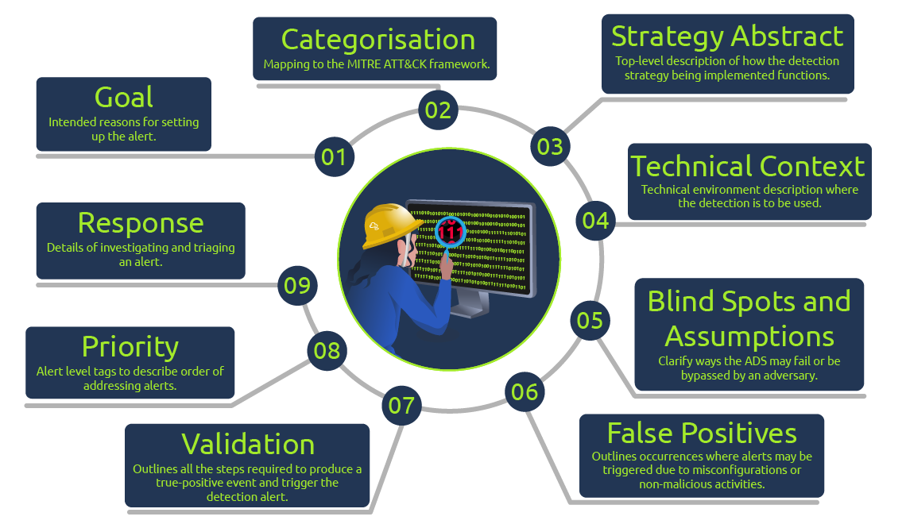

# Intro to Detection Engineering

Introduce the concept of detection engineering and the frameworks used towards crafting effective threat detection strategies.

link : [https://tryhackme.com/room/introtodetectionengineering](https://tryhackme.com/room/introtodetectionengineering)

Subscription type : Free 

### What is detection engineering ?

It is the systematic process of designing , building and refining the logic used to identify cyber threats . 

### Detection Types :

There are two types of detection with two sub types for each : 

1. Environment based detection 
2. Threat based detection

### Environment based detection :

focuses on looking at changes in an environment based on configurations and baseline activities that have been defined. Within this detection, we have Configuration detection and Modelling.

**Configuration Detection → we use current knowledge of the known environments and infrastructure to identify misalignments , configurations can cross domains , including network , asset or identity .**

**Benefits :** 

- easiest form of detection to create and maintain in static environment .
- easy to combine with other detections .

**Challenges :** 

- difficult to maintain in dynamic environments .
- frequent configuration changes can result in high false positives .

**Modelling :** 

Threat detection under this type is done by defining baseline operations and activities and recording any deviations that occur.

**Benefits :**

- Used to identify unknown adversary activities due to model changes and not threat characteristics.
- Easy to maintain in very static environments.

**Challenges :**  

- Provides no context of threat activity during investigations.
- Difficult to maintain in dynamic environments.

### Threat based detection :

focuses on elements associated with an adversary’s activity, such as tactics, tools and artefacts that would identify their actions. Under this, we have Indicators and Threat Behaviour detections.

**Indicator Detection :** 

IOCs are commonly referenced and derived from investigations against malicious events. By observing threat activities and investigations, analysts can use identified indicators to craft detections and adapt them based on an adversary’s rate of change.

**Benefits :** 

- Fastest detection to create and deploy.
- Useful for enriching data sources and detections.

**Challenges :** 

- The value of detection depends on the adversary’s rate of change.
- one needs to observe the indicator first.

**Threat Behaviour Detection :** 

Analysts will look at an adversary’s Tactics, Techniques and Procedures (TTPs) to conduct an attack, regardless of any specific indicators. This makes detection more scalable beyond indicators.

**Benefits :** 

- Withstands the adversary’s rate of change.
- Easy to tune and adapt to different environments.

**Challenges :**

- Due to the adversary’s complexities, lots of data is required to provide complete coverage.
- Moderately difficult to make initial implementations due to baseline assessments.

### **Detection as Code :**

Detection as Code (DaC) is a structured approach to writing detections by incorporating software engineering best practice principles. 

DaC offers a code-driven workflow that creates fine-tuned detection processes that introduce critical elements found in Continuous Integration/Continuous Development (CI/CD) workflows. Some of these elements include:

- **Version Control:** Most SIEMs and  products lack the ability to track changes made to alerts and their definitions. By introducing version control, detection rules and processes can be quickly reviewed, tested and accounted for, enabling higher-quality detections.
    
    EDR
    
- **Automation workflows:** By adopting a / workflow, detection testing can be automated and allow quick transition and production delivery.
    
    

---

**Benefits :** 

- Customizable and flexible detections
- code reusability

### Answers :

Which detection type focuses on misalignments within the current infrastructure?

```html
Configuration
```

Which detection approach involves building an asset or activity baseline profile for detection?

```html
Modelling
```

Which type of detection integrates with defensive playbooks?

```html
Threat Behaviour
```

### Detection Gap Analysis

The first step involves looking at the environment and identifying key areas where organisations can improve threat detection. This process is also known as **threat modelling** and can be done in the following ways:

- **Reactive**: Assessing the most recent internal incident reports, taking note of the lessons learnt from the attacks and curving out missed areas of possible detection.
- **Proactive**: Using the ATT&CK framework and various threat intelligence sources to map out potential areas of attack and the various TTPs that an adversary against your environment may use.

### **Datasource Identification and Log Collection**

With information about the relevant threat actors, TTPs and potential risks the organisation may face, sources of relevant data associated with the risks need to be identified.

**Baseline Creation :** 

Before using all the collected information about adversaries .security analysts need to know what normal behaviour is and set their security baselines. 

Security baselines can be grouped into two categories:

- **High-level:** This sets broad  independent standards guided by a specified security policy.
    
    OS
    
- **Technical:** This consists of based configuration standards outlining different system functions and the intended behaviours or activities. For example, technical baselines outline  hardening policies, network activities, Identity and Access Management () policies, and application policies.
    
    

**Log Collection :** 

Once the baselines and sources of internal data have been identified and prioritised , the collection of logs and metadata useful for threat detection should be done.

### **Rule Writing :**

Based on the infrastructure setup and SIEM services, detection rules will need to be written and tested against the data sources.

 Detection rules test for abnormal patterns against logged events.

Network traffic would be assessed via Snort rules, while Yara rules would evaluate file data.

### **Deployment, Automation & Tuning :**

Tested detection rules must be put into production to be assessed in a live environment. Over time, the detections would need to be modified and updated to account for changes in attack vectors, patterns or environment. This improves the quality of detection .

## Detection Engineering Frameworks 1

- **MITRE’s ATT&CK and CAR Frameworks**
- **Pyramid of Pain**
- **Cyber Kill Chain**
- **Unified Kill Chain**

### ANSWERS :

Which framework looks at how to make it difficult for an adversary to change their approach when detected?

```html
Pyramid of Pain
```

What is the improved Cyber Kill Chain framework called?

```html
The Unified Kill Chain
```

How many phases are in the improved kill chain?

```html
18
```

## Detection Engineering Frameworks 2

**Alerting and Detection Strategy Framework** 

Palantir developed the ADS Framework to provide a guideline for documenting detection content.  A significant challenge faced by security teams, and Palantir being no exception, is alert fatigue and apathy, mainly caused by poor means of developing and implementing detection alerts that would result in effective incident response and mitigation. The ADS Framework seeks to address this challenge and provide a guideline for constructing effective detections and alerts.

The ADS Framework has a strict flow that detection engineers must follow before publishing detection rules into production. The stages involved are:



## **Detection Maturity Level Model :**

[Ryan Stillions(opens in new tab)](http://ryanstillions.blogspot.com/2014/04/the-dml-model_21.html) brought forward the Detection Maturity Level (DML) model in 2014 as a way for an organisation to assess its maturity levels concerning its ability to ingest and utilise cyber threat intelligence in detecting adversary actions. According to Ryan, there are two guiding principles for this model:

1. An organisation's maturity is not measured by its capabilities of obtaining valuable intelligence but by its ability to apply it to detection and response.
2. Without established detection functions, there is no opportunity to carry out response functions.


What is the flag? 

categorisation → account manipulation 

part of strategy abstract → collect logs related to the  AD changes .

part of response plan → **Validate the group modified, user added and the user making the change.**

flag :

```html
THM{Sup3r-D3t3ct1v3}
```