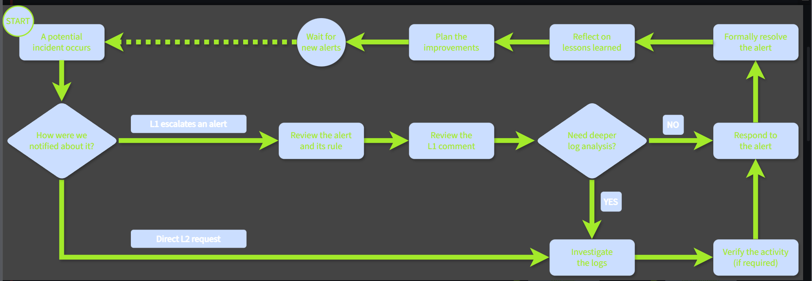

# SOC L2 ALERT TRIAGE

Learn how to triage escalated alerts and respond to cyber threats.

Subscription : free 

Difficulty : easy 

link : [TryHackMe | SOC L2 Alert Triage](https://tryhackme.com/room/socl2alerttriage)

## SOC L2 WORKFLOW :

While L1 focus on triage speed and alert review, L2 focus on triage quality and deeper log analysis.

### Difference between l1 and l2 alert triage :

Service Level Agreement (SLA) is a document signed between a service provider (e.g. SOC team) and its customer defining the uptime and quality requirements.

What is the most common trigger for L2 to start the triage? 

ans : escalated alert 

## **Log Analysis as L2**

In an ideal scenario, the information you'll get from alert details and L1 comment will be sufficient to make a confident verdict without a need for deeper log analysis, but usually we still need to do a full investigation.

don’t forget about these : 

**See What Happened :** 

create a story related to the alert like : 

**Build Detailed Timelines**

forming the story will help us to get an overview of the alert but it doesn’t tell about the attacks indicators , to get the useful information we have to build a detailed timeline . 

Below is an example of a Splunk timeline that:

1. Filters for key  events from the NetDbg application
    
    Sysmon
    
2. Highlights three indicators that may be useful in future triage(`lxdhk.dll`, `netupdate-pro.shop`, `159.89.143.156`)
3. Confirms that NetDbg is either compromised or a malware itself(A suspicious connection followed by  drop and execution)
    
    DLL
    

**Threat Hunting Loop :** 

A typical l2 case is simple enough to resolve with a single timeline , but sometimes in alerts like the above one many questions remain open , in the above example case now we have to ask our IT regarding the netdbg app and find out who installed it , and how that use appeared in that network , for such cases L2 log analysis becomes a threat hunting loop : 

## Threat Response :

**Verification of Activity**

Imagine we are triaging an anomalous login alert where a user signs in to their Microsoft account through Proton VPN. The actions following the login look legitimate, but you're still concerned it could be a breach. Only the user themselves can confirm "yes, that was me", so the next step is to reach out directly. If the risk is high and there is no immediate reply, **disable the account until they confirm**. 

*Above is the most common type of activity verification.If the user doesn't respond, disable the account and reach out to their manager*

**Response to True Positives :** 

after verifying the activity , make a final true positive or false positive verdict , to start the response , for a localized infections such as adware on an employee’s laptop , a file quarantine via EDR is sufficient . 

**Response to Major Incidents :** 

For major incidents where every second matters, you may need to contain the threat before the investigation is finished. 

 If you see ongoing data exfiltration but don't yet know how it started, stop it first, then investigate.

in this type of situations we have to ensure the three parts of the respone : 

1. **Containment**: Stop the threat from spreading by isolating hosts or disabling users
2. **Eradication**: Clean up malware files, rotate stolen passwords, revoke privileges, etc.
3. **Recovery**: Lift containment, patch the vulnerabilities, monitor for reinfection traces

**Response to False Positives :** 

Even False Positives can require a response, just not so urgent as to the real threats.

**Resolving the Case :** 

A case can be resolved once the verdict is set and the threat is fully remediated. Resolution processes vary by company and can involve ticketing routine and other formalities, but three best practices always apply:

- Leave evidence of your actions in a centralized storage (e.g., a ticketing system)
- Inform your SOC team about the incident, especially those you saw for the first time
    
    
- Keep other parties updated, especially  MSSP customers (e.g., with a summary report)
    
    

## **Learning Lessons :**

Overall, learn the lessons from every alert!